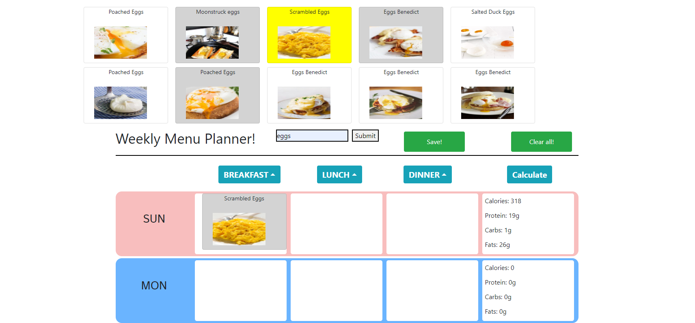

# Meal-Prep
## Weekly Meal Prep Website

## Table of contents

- [General info](#general-info)
- [Technologies](#Technologies)
- [Deployment](#Deployment)
- [Code Overview](#Code-Overview)
- [Summary](#Summary)
- [CSS style](#CSS-style)
- [Main](#Main)

## General info

This is a simple meal-prep application. The user can enter a meal name to search for meals, then drag the `meal` card onto the calendar slot. Calories and other nutrient data are then totaled for the week. User accounts are stored in firebase. 

Deployed Link: https://daneshrewsbury2288.github.io/Meal-Prep/intro.html

;

## Technologies

Project is created with:

- [JavaScript](https://www.javascript.com/)
- [Bootstrap](https://getbootstrap.com/)
- [Food2ForkAPI](https://www.food2fork.com/api)

## Deployment

Deployed via GitHub

## Code Overview

- HTML, CSS, Bootstrap, JavaScript

## Summary

- Meal Prep Application

## CSS style

- Bootstrap and CSS were used to create the UI of this website. 

## Main

- Application Keys:
- b4a9d4d9acaf471f9a836e6615157895

- Application ID:
- aee51471

## Authors

- Anthony Lam
- Alex Wong
- Dane Shrewsbury

## License

- Open Source
- Created for the University of Washington Code-Boot Camp 2019: Project #3

